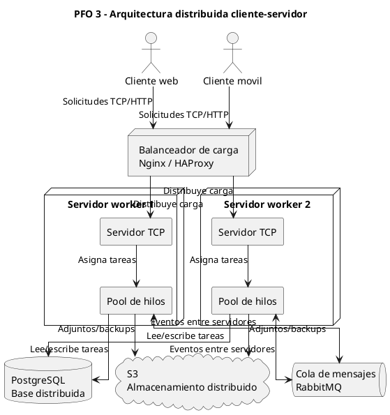

# PFO 3: Rediseño como Sistema Distribuido Cliente-Servidor

Sistema de gestión de tareas personales implementado con Python, sockets TCP y un servidor concurrente con pool de workers.

La versión anterior usaba Flask, HTTP y SQLite. Esta versión reemplaza la API REST por comunicación directa mediante sockets, manteniendo la idea funcional de registrar usuarios, iniciar sesión y gestionar tareas.

## Arquitectura implementada

- `cliente.py`: cliente de consola que se conecta al servidor por socket TCP.
- `servidor.py`: servidor TCP que acepta múltiples clientes concurrentes.
- Pool de workers: las solicitudes recibidas se delegan a un `ThreadPoolExecutor`.
- SQLite: persistencia local para usuarios y tareas del prototipo.
- Protocolo: mensajes JSON terminados en salto de línea.

## Diagrama del sistema distribuido

El siguiente código está en formato PlantUML. Se puede pegar en herramientas gratuitas como:

- [PlantText](https://www.planttext.com/)
- [PlantUML Online Server](https://www.plantuml.com/plantuml/)



## Requisitos

- Python 3.10 o superior

No hace falta instalar Flask ni Requests. La implementación usa únicamente la biblioteca estándar de Python.

## Ejecución

En una terminal, iniciar el servidor:

```bash
python3 servidor.py
```

Por defecto escucha en `127.0.0.1:5001` y crea la base `tareas.db` automáticamente.

Opcionalmente se puede cambiar host, puerto y cantidad de workers:

```bash
python3 servidor.py --host 127.0.0.1 --port 5001 --workers 4
```

En otra terminal, iniciar el cliente:

```bash
python3 cliente.py
```

Si el servidor usa otro host o puerto:

```bash
python3 cliente.py --host 127.0.0.1 --port 5001
```

## Funcionalidades del cliente

1. Registrar usuario.
2. Iniciar sesión.
3. Ver tareas propias.
4. Crear tarea.
5. Eliminar tarea.
6. Cerrar sesión.

## Protocolo de comunicación

Cada solicitud enviada por el cliente es un objeto JSON terminado en `\n`.

Ejemplo para registrar un usuario:

```json
{"accion":"registrar","usuario":"martin","contrasena":"1234"}
```

Respuesta exitosa:

```json
{"ok":true,"mensaje":"Usuario 'martin' registrado exitosamente."}
```

Ejemplo para crear una tarea:

```json
{"accion":"crear_tarea","usuario":"martin","contrasena":"1234","descripcion":"Estudiar sockets"}
```

Respuesta:

```json
{"ok":true,"mensaje":"Tarea creada.","tarea":{"id":1,"descripcion":"Estudiar sockets","creada_en":"2026-06-07 13:30:00"}}
```

## Relación con la consigna

- El punto 1 se cubre con el diagrama de arquitectura distribuida.
- El punto 2 se cubre con el servidor TCP que recibe tareas por socket, las distribuye a workers y devuelve respuestas al cliente.
- El cliente envía solicitudes por socket y recibe los resultados del servidor.

## Archivos principales

- `servidor.py`: servidor TCP, pool de workers, persistencia SQLite.
- `cliente.py`: cliente interactivo por consola.
- `docs/index.html`: página de documentación para GitHub Pages.
- `docs/diagrama.puml`: código PlantUML del diagrama.
